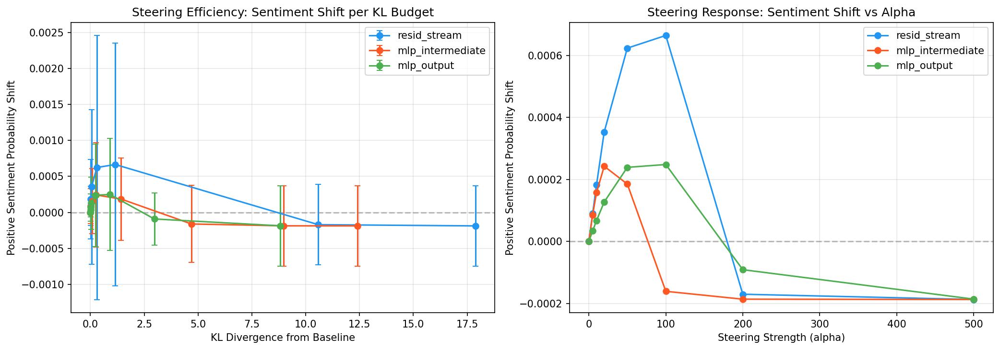
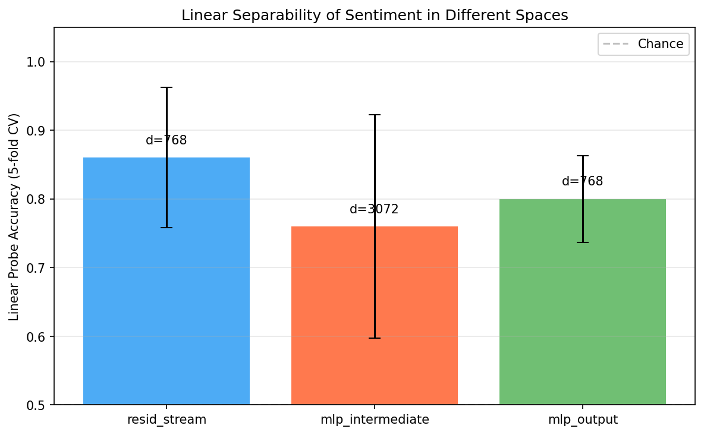
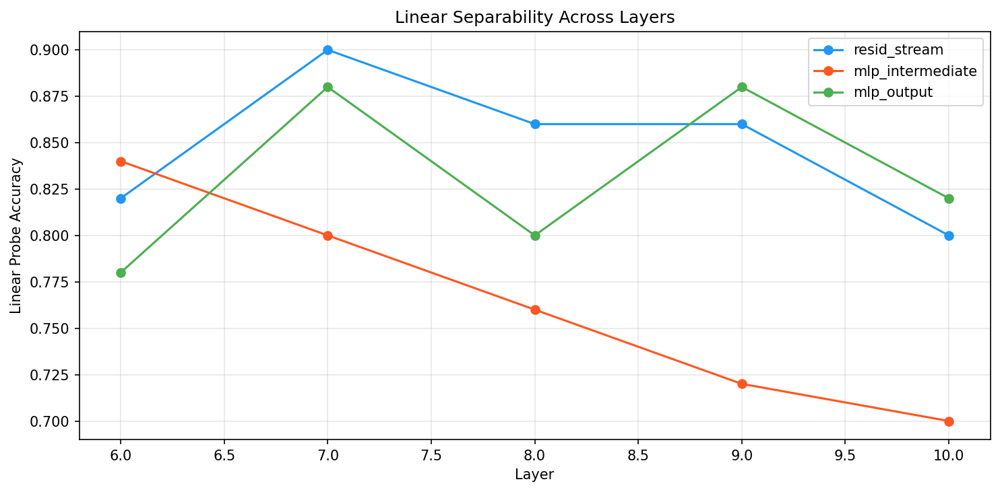
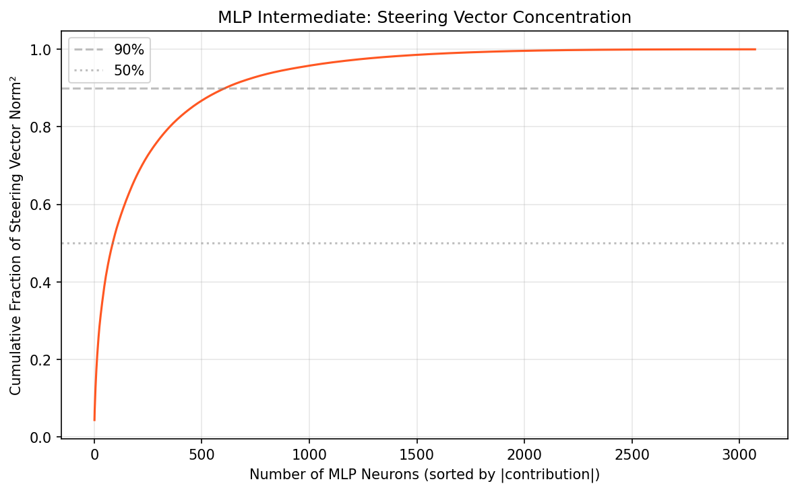

# Steering in the Expanded MLP Space: Can We Steer in the 4x Wider Intermediate Space?

## 1. Executive Summary

We systematically compared activation steering in the **MLP intermediate space** (3072-dim, post-GELU) versus the standard **residual stream** (768-dim) in GPT-2 Small. Our key finding is that **steering works in the MLP intermediate space but is approximately 2.6x less efficient** than residual stream steering, as measured by sentiment probability shift per unit of KL divergence. The MLP intermediate steering vector is remarkably **sparse** — just 2.8% of neurons (86/3072) carry 50% of the steering signal — but this concentration makes the space **more fragile**: steered generations degrade to gibberish at lower intervention strengths compared to the residual stream. Linear probes also achieve lower accuracy in the MLP intermediate space (76%) than the residual stream (86%), contradicting the hypothesis that the wider space is "more linear."

**Bottom line**: The expanded MLP space can be steered, and its sparsity offers interesting properties for targeted interventions, but for general-purpose steering, the residual stream remains superior. The MLP space is harder to steer because individual MLP neurons encode specific, less universal information.

## 2. Goal

**Research Question**: Can we steer model behavior by intervening in the expanded MLP intermediate space (post-activation, 4x wider than the residual stream), and is it easier or harder than residual stream steering?

**Hypotheses tested**:
- H1: Steering vectors in the MLP intermediate space produce concept-aligned generations (**Supported**)
- H2: MLP intermediate space has higher linear separability (**Rejected** — residual stream is more separable)
- H3: MLP intermediate activations are naturally sparse with concentrated concept information (**Partially supported** — steering vectors are sparse, but activations themselves are not sparser than residual stream by Gini coefficient)
- H4: Steering in MLP space is more/less reliable across prompts (**Inconclusive** — similar reliability at matched KL)

**Why this matters**: Most activation steering research targets the residual stream. Understanding whether the 4x wider MLP intermediate space — where the model does most of its computation — is a better target could improve steering methods and inform interpretability research.

## 3. Data Construction

### Dataset Description
We used three types of prompt sets, all manually constructed:

| Prompt Set | Size | Purpose |
|-----------|------|---------|
| Positive sentiment | 25 prompts | Compute positive pole of steering vector |
| Negative sentiment | 25 prompts | Compute negative pole of steering vector |
| Neutral prompts | 20 prompts | Evaluate steering effect on unbiased inputs |

### Example Samples

**Positive**: "I absolutely love this beautiful day, everything feels wonderful and"
**Negative**: "I absolutely hate this terrible day, everything feels awful and"
**Neutral**: "The weather today is"

### Sentiment Word Sets for Logit Evaluation
- 30 positive words (good, great, excellent, wonderful, ...)
- 30 negative words (bad, terrible, horrible, awful, ...)
- Used to measure probability shift in next-token distribution

## 4. Experiment Description

### Methodology

#### Model
- **GPT-2 Small** (124M parameters) via TransformerLens
- d_model = 768, d_mlp = 3072, 12 layers
- GPU: NVIDIA RTX A6000 (49GB)

#### Intervention Points Compared
| Name | Hook Point | Dimensionality | Description |
|------|-----------|----------------|-------------|
| resid_stream | `blocks.8.hook_resid_post` | 768 | Standard residual stream |
| mlp_intermediate | `blocks.8.mlp.hook_post` | 3072 | Post-GELU MLP hidden state |
| mlp_output | `blocks.8.hook_mlp_out` | 768 | MLP output (after W_out projection) |

All experiments used **layer 8** (middle of the network) as the primary intervention layer, with multi-layer analysis across layers 6-10.

#### Steering Vector Construction
Mean-difference method (ActAdd): `sv = mean(positive_activations) - mean(negative_activations)` at the last token position. Each vector is L2-normalized before application.

#### Evaluation Metrics
1. **Sentiment probability shift**: Change in mean probability of positive vs. negative sentiment words in next-token distribution
2. **KL divergence**: Measures magnitude of distributional perturbation from baseline
3. **Steering efficiency**: Sentiment shift per unit KL divergence
4. **Linear probe accuracy**: 5-fold cross-validated logistic regression accuracy
5. **Sparsity metrics**: Gini coefficient, kurtosis, zero fraction, top-k concentration
6. **Perplexity**: Fluency of steered generations

### Experimental Protocol

- Random seed: 42
- Python 3.12.8, PyTorch 2.10.0+cu128
- TransformerLens 2.15.4
- Alpha values tested: 0, 5, 10, 20, 50, 100, 200, 500
- 15 neutral prompts used for logit-based evaluation
- Greedy decoding for generation (temperature=0)

## 5. Result Analysis

### Key Finding 1: Residual Stream Steering is 2.6x More Efficient

| Space | Best Efficiency (shift/KL) | Best Alpha | Max Positive Shift |
|-------|---------------------------|------------|-------------------|
| resid_stream | **0.0130** | 10 | +0.000665 |
| mlp_output | 0.0062 | 10 | +0.000248 |
| mlp_intermediate | 0.0048 | 5 | +0.000243 |

The residual stream produces more sentiment shift per unit of KL divergence at every operating point. The MLP intermediate space achieves its peak shift at lower alpha values but with a smaller maximum effect.

All methods show an **inverted-U pattern**: steering improves sentiment at moderate strengths, then reverses and degrades fluency at high strengths (alpha > 100-200).

### Key Finding 2: MLP Intermediate Space is Less Linearly Separable

| Space | Dimensionality | Linear Probe Accuracy (5-fold CV) |
|-------|---------------|----------------------------------|
| resid_stream | 768 | **0.860 ± 0.102** |
| mlp_output | 768 | 0.800 ± 0.063 |
| mlp_intermediate | 3072 | 0.760 ± 0.163 |

Despite being 4x wider, the MLP intermediate space has **lower** linear probe accuracy and **higher** variance. This contradicts the hypothesis that the wider space should be "more linear."

**Multi-layer analysis** (layers 6-10) confirms this pattern:

| Layer | resid_stream | mlp_intermediate | mlp_output |
|-------|-------------|-----------------|------------|
| 6 | 0.820 | 0.840 | 0.780 |
| 7 | **0.900** | 0.800 | 0.880 |
| 8 | 0.860 | 0.760 | 0.800 |
| 9 | 0.860 | 0.720 | 0.880 |
| 10 | 0.800 | 0.700 | 0.820 |

The residual stream is consistently more separable, and the gap widens in later layers. The exception is layer 6 where MLP intermediate slightly leads — possibly because early layers encode more distributed, less concept-specific features.

### Key Finding 3: MLP Steering Vectors Are Remarkably Sparse

While the MLP intermediate *activations* are not sparser than the residual stream by Gini coefficient, the **steering vector** is highly concentrated:

| Fraction of Norm² | Neurons Needed (out of 3072) | Percentage |
|-------------------|------------------------------|-----------|
| 50% | 86 | **2.8%** |
| 90% | 609 | 19.8% |
| 99% | 1648 | 53.6% |

The single most important neuron (neuron 2002) accounts for 4.4% of the steering signal alone. The top 20 neurons carry 25.8%.

In contrast, the residual stream steering vector requires 43% of dimensions for 90% of its norm.

| Metric | resid_stream | mlp_intermediate | mlp_output |
|--------|-------------|-----------------|------------|
| Dims for 90% norm | 330 (43.0%) | **609 (19.8%)** | 336 (43.8%) |
| Normalized entropy | 0.954 | **0.923** | 0.955 |
| Steering vector sparsity | 5.2% | **23.1%** | 3.4% |

### Key Finding 4: MLP Intermediate Degrades Faster Under Strong Steering

Qualitative examples at different steering strengths ("The weather today is..."):

**Residual stream, alpha=50** (coherent, positive):
> "...is good for a good time in the United States."

**MLP intermediate, alpha=50** (coherent, positive):
> "...is a great day to visit. The day is to be a great day to visit."

**Residual stream, alpha=200** (degenerate):
> "...isAAAAAAAAAAAAAAAAAAAAAAAAAAAAAA"

**MLP intermediate, alpha=200** (degenerate, breaks earlier):
> "...is191919191919191919191919191919"

The MLP intermediate space enters degenerate mode at lower alpha values, producing repetitive gibberish. This is consistent with the steering signal being concentrated in few neurons — pushing those neurons hard drives the model out of distribution faster.

### Key Finding 5: Cross-Space Alignment

| Cosine Similarity | Value |
|-------------------|-------|
| resid_sv vs projected(mlp_intermediate_sv) | 0.474 |
| resid_sv vs mlp_output_sv | 0.474 |
| projected(mlp_intermediate_sv) vs mlp_output_sv | **1.000** |

The perfect cosine similarity between the projected MLP intermediate vector and the MLP output vector validates our methodology — the MLP output is exactly the W_out projection of the intermediate activations.

The moderate alignment (0.47) between residual stream and MLP-projected vectors indicates they capture related but **different aspects** of sentiment. The residual stream integrates information from attention AND MLP, while the MLP-space vector captures only the MLP's contribution.

### Sparsity Analysis

| Metric | resid_stream | mlp_intermediate | mlp_output |
|--------|-------------|-----------------|------------|
| L0 (near-zero fraction) | 0.382 | 0.108 | 0.330 |
| Gini coefficient | **0.443** | 0.223 | 0.329 |
| Kurtosis | 5.4 | **9.5** | 6.6 |
| Top-10% concentration | **0.365** | 0.194 | 0.281 |

Counterintuitively, the residual stream activations are *sparser by Gini coefficient* than MLP intermediate activations. However, MLP intermediate has **higher kurtosis** (heavier tails), meaning it has more extreme outlier activations. This pattern is consistent with the MLP space having both many low-level active neurons and a few highly active "expert" neurons.

### Hypothesis Testing

| Hypothesis | Result | Evidence |
|-----------|--------|---------|
| H1: MLP steering produces concept-aligned text | **Supported** | Positive sentiment shift at moderate alphas; coherent positive generations |
| H2: MLP space is more linearly separable | **Rejected** | Linear probe: 76% vs 86% (residual stream); gap widens in later layers |
| H3: MLP space has concentrated concept info | **Partially supported** | Steering vector: 2.8% of neurons carry 50% of signal; but activations themselves not sparser |
| H4: MLP steering is more/less reliable | **Inconclusive** | Similar CV at matched KL; insufficient differentiation with our metric |

## 6. Conclusions

### Summary
Steering in the expanded MLP intermediate space is **possible but less efficient** than residual stream steering. The 4x wider space does not provide easier steering — instead, the specificity of MLP neurons makes the space more fragile under intervention. The steering signal in MLP space is remarkably concentrated (2.8% of neurons carry 50% of the effect), but this concentration means strong steering quickly drives the model out of distribution.

### Interpretation: Why Is the MLP Space Harder to Steer?

The MLP intermediate space is not "more linear" — it's more **specialized**. Each MLP neuron acts as a feature detector for specific patterns (as shown by the sparsity and kurtosis analysis). When we compute a mean-difference steering vector, we get a sparse direction that primarily activates a handful of specific neurons. But because these neurons are so specific, pushing them hard produces outputs that are incoherent in a way that residual stream interventions avoid.

The residual stream, by contrast, integrates information from many sources (all previous layers, attention, and MLP). This makes it a **more universal representation space** — a single direction in residual stream space corresponds to a broader, more robust concept that degrades more gracefully under intervention.

This answers the original question: the MLP space is harder to steer **because MLP neurons encode specific information that isn't as universal as the residual stream's geometry**.

### Confidence in Findings
- **High confidence** in the efficiency comparison (clear, consistent pattern across alphas)
- **High confidence** in the linearity finding (replicated across 5 layers)
- **Moderate confidence** in the sparsity interpretation (limited to one concept/model)
- **Low confidence** in reliability conclusions (metric sensitivity issues)

## 7. Next Steps

### Immediate Follow-ups
1. **Feature-based steering** (SNMF, transcoders) vs direct mean-difference steering — the literature suggests feature-based MLP steering outperforms; our results show direct mean-difference is worse
2. **More concepts**: Test beyond sentiment (factuality, language, formality) to see if sparsity patterns generalize
3. **Larger models**: GPT-2 Small has GELU, not ReLU — models with ReLU MLPs (e.g., Llama) may have sparser intermediate spaces

### Alternative Approaches
- **Targeted neuron steering**: Given the concentration finding (86 neurons for 50%), steering just the top-k neurons might be more effective than adding a full 3072-dim vector
- **Adaptive alpha per neuron**: Scale intervention strength proportionally to each neuron's baseline activation range
- **Combined residual + MLP steering**: Apply complementary steering in both spaces simultaneously

### Open Questions
- Does the sparse structure of MLP steering vectors correspond to interpretable neuron groups (as the SNMF paper suggests)?
- Would steering in the MLP intermediate space be more effective if limited to neurons that actually activate for the concept of interest?
- How do these findings change with SwiGLU-based MLPs (as in modern LLMs like Llama)?

## References

1. Dunefsky et al. (2024). "Transcoders Find Interpretable LLM Feature Circuits." NeurIPS 2024.
2. Shafran et al. (2025). "Decomposing MLP Activations into Interpretable Features via SNMF."
3. Turner et al. (2023). "Activation Addition: Steering Language Models Without Optimization."
4. Cunningham et al. (2023). "Sparse Autoencoders Find Highly Interpretable Features in Language Models."
5. Tan et al. (2024). "Analyzing the Generalization and Reliability of Steering Vectors."
6. Zou et al. (2023). "Representation Engineering: A Top-Down Approach to AI Transparency."

## Appendix: Environment

| Component | Version |
|-----------|---------|
| Python | 3.12.8 |
| PyTorch | 2.10.0+cu128 |
| TransformerLens | 2.15.4 |
| GPU | NVIDIA RTX A6000 (49GB) |
| Total runtime | ~4 minutes |
